# CloudShip Station - Executive Summary

## The Strategic Opportunity

CloudShip Station addresses a critical gap in the enterprise AI landscape: **secure, deployable sub-agents for internal infrastructure operations**. While current AI platforms focus on application development, enterprises need intelligent automation that can safely access internal systems, manage production credentials, and integrate with existing DevOps workflows.

## Market Problem Analysis

### Current Challenge: Fragmented AI Agent Ecosystem

Based on strategic analysis, enterprises face several critical challenges:

1. **Security Gaps**: Cloud-based agents cannot safely handle production credentials and internal system access
2. **Deployment Complexity**: No standardized way to version, deploy, and manage agents across environments  
3. **Tool Fragmentation**: Teams build isolated solutions without reusable, approved toolchains
4. **Operational Risk**: Agents with excessive permissions create security vulnerabilities

### The Fear Factor

**Key Insight from Whiteboard Analysis**: *"Fear of agents being cloud-based in their environment"*

Enterprises are willing to adopt AI with their development teams, managers, and operations, but require:
- **Local Control**: Self-hosted solutions with complete data sovereignty
- **Environment Isolation**: Separate dev/staging/prod contexts with encrypted secrets
- **Audit Compliance**: Complete tracking of agent deployments and executions
- **Team Governance**: Approved tools and restricted agent capabilities

## CloudShip Station Solution

### Core Value Proposition

**"Lightweight Runtime for Deployable Sub-Agents"**

Station provides a secure, self-hosted platform specifically designed for enterprise infrastructure needs:

#### 🔧 **Purpose-Built for Internal Operations**
- Database monitoring with production credentials
- Infrastructure deployment automation
- Security scanning with elevated permissions  
- Incident response with system-level tools

#### 🔐 **Security by Design**
- **Self-Hosted**: Complete data sovereignty
- **Encrypted Secrets**: AES encryption for credentials
- **Environment Isolation**: Dev/staging/prod separation
- **Audit Trail**: Complete deployment tracking

#### ⚡ **Lightweight & Integrated**
- **45MB Binary**: Single executable with embedded SQLite
- **GitOps Ready**: Version-controlled agent configurations
- **MCP Ecosystem**: 90+ production-ready tools

## Strategic Architecture Overview

### Three-Tier Deployment Model

```mermaid
graph TB
    subgraph "CloudShip AI Hub"
        CS[CloudShip AI<br/>STN RUNS, ANALYTICS<br/>MANAGEMENT, CONSOLIDATED VIEW<br/>TEAM DEFINED SECRETS]
    end
    
    subgraph "Development Environments"
        DEV[DEV Environment<br/>STN Runtime]
        TEAM[Team Server<br/>STN Runtime]
        STAGE[Stage Environment<br/>STN Runtime]
    end
    
    subgraph "Go-to-Market Strategy"
        GTM[GTM Strategy<br/>• Engineer w/Teams Adoptions<br/>• Open Source<br/>• Control Plane]
    end
    
    CS --> DEV
    CS --> TEAM  
    CS --> STAGE
    CS --> GTM
```

## Competitive Differentiation

### vs. Application-Focused AI Platforms

| Traditional AI Platforms | CloudShip Station |
|--------------------------|-------------------|
| Cloud-hosted, SaaS model | Self-hosted, on-premises |
| Application development focus | Infrastructure operations focus |
| Limited internal system access | Full production credential access |
| Vendor lock-in | Open source, AGPL-3.0 |
| Generic tool ecosystem | Infrastructure-specific MCP tools |

### vs. Infrastructure Automation Tools

| Traditional DevOps Tools | CloudShip Station |
|-------------------------|-------------------|
| Static automation scripts | Intelligent, context-aware agents |
| Manual configuration | AI-driven decision making |
| Limited adaptability | Dynamic response to conditions |
| Tool-specific solutions | Unified agent platform |

## Market Opportunity

### Primary Market Segments

1. **Enterprise DevOps Teams** (TAM: $15B)
   - Infrastructure monitoring and automation
   - CI/CD pipeline management
   - Security and compliance operations

2. **Site Reliability Engineering** (TAM: $8B)
   - System monitoring and alerting
   - Incident response automation
   - Performance optimization

3. **Security Operations** (TAM: $7B)
   - Vulnerability scanning and alerting
   - Incident response automation
   - Compliance and audit automation

4. **Cloud Operations** (TAM: $5B)
   - Multi-cloud management
   - Cost optimization
   - Resource provisioning

### Adoption Strategy

**Bottom-Up Enterprise Adoption**

Based on whiteboard analysis insights:

1. **Engineer Adoption**: Teams willing to use AI with their developers
2. **Management Buy-in**: Demonstrable ROI through automation
3. **Department Expansion**: Success in one team drives adoption
4. **Enterprise Rollout**: Organization-wide deployment

## Financial Model

### Revenue Streams

1. **Enterprise Licenses**: Self-hosted deployment licenses
2. **Professional Services**: Implementation and consulting
3. **Support Subscriptions**: Enterprise support and SLA
4. **MCP Marketplace**: Premium tool integrations

### Competitive Pricing Strategy

- **Open Source Core**: Free community edition drives adoption
- **Enterprise Features**: Security, compliance, and management tools
- **Per-Agent Pricing**: Scalable revenue model aligned with value

## Investment Requirements

### Immediate Priorities (0-6 months)

1. **Product Development**: Complete enterprise security features
2. **Go-to-Market**: Sales and marketing team expansion  
3. **Ecosystem Development**: MCP tool partnerships
4. **Customer Success**: Implementation and support capabilities

### Growth Investment (6-18 months)

1. **International Expansion**: Global sales presence
2. **Platform Expansion**: Additional enterprise integrations
3. **R&D Investment**: Advanced AI capabilities
4. **Acquisition Strategy**: Complementary technology stack

## Strategic Recommendations

### For Advisors

1. **Market Timing**: Perfect inflection point for enterprise AI adoption
2. **Differentiated Positioning**: Clear competitive moats in security and deployment
3. **Scalable Architecture**: Technology foundation supports rapid growth
4. **Enterprise Traction**: Bottom-up adoption model reduces sales friction

### Next Steps

1. **Pilot Customer Program**: Identify 3-5 enterprise early adopters
2. **Partnership Strategy**: Integrate with major cloud and DevOps platforms  
3. **Funding Round**: Series A to accelerate go-to-market execution
4. **Team Expansion**: Engineering, sales, and customer success hiring

---

**CloudShip Station represents a strategic opportunity to capture the enterprise AI infrastructure market through purpose-built, secure, deployable sub-agent technology.**
