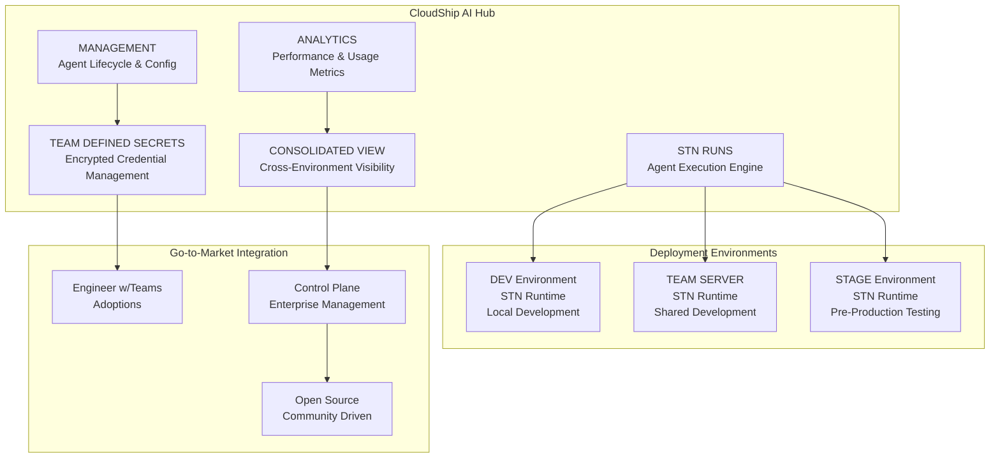
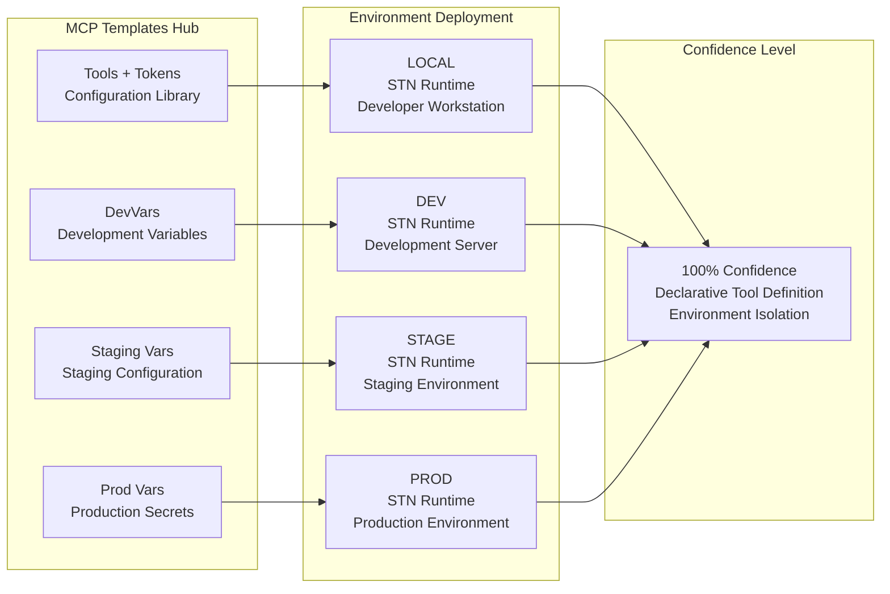
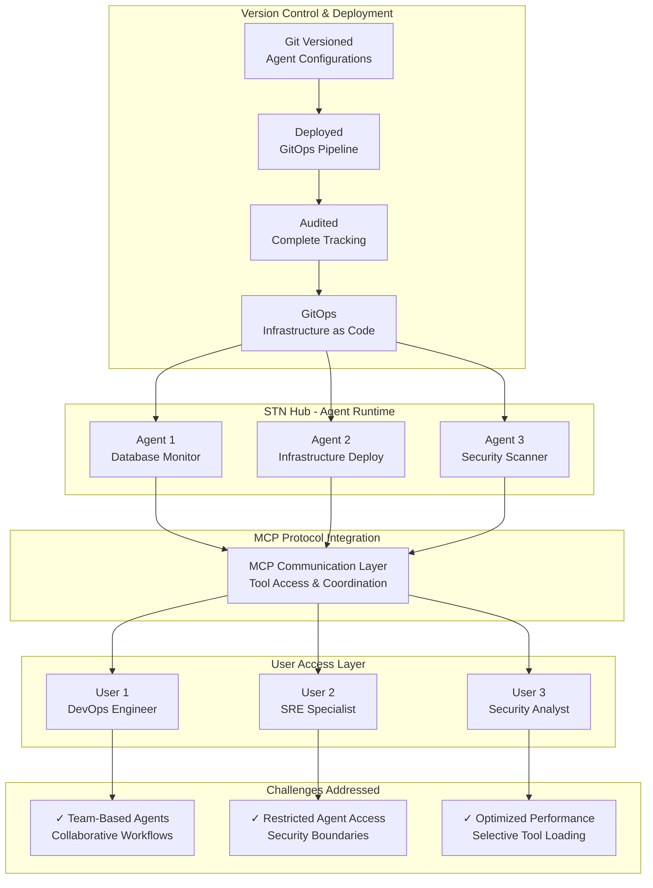
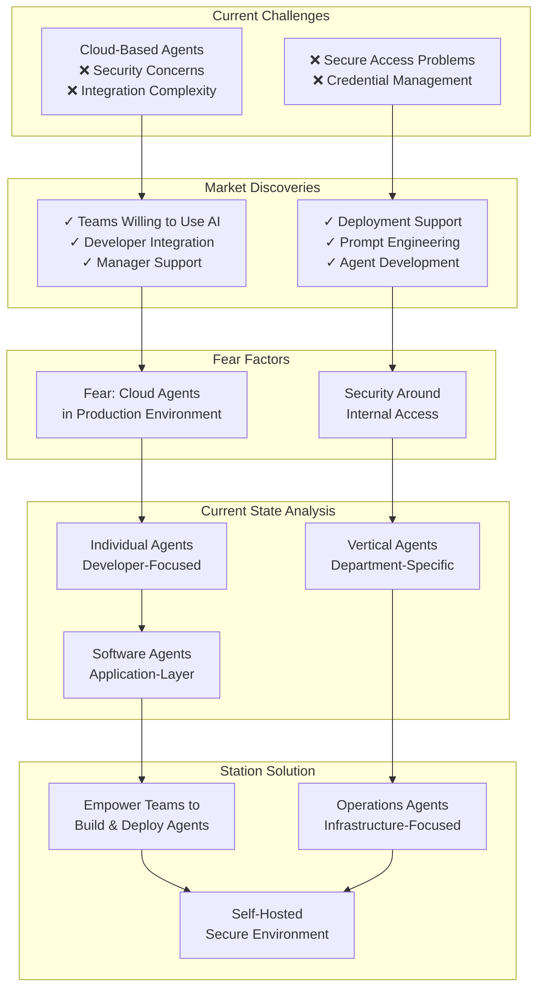
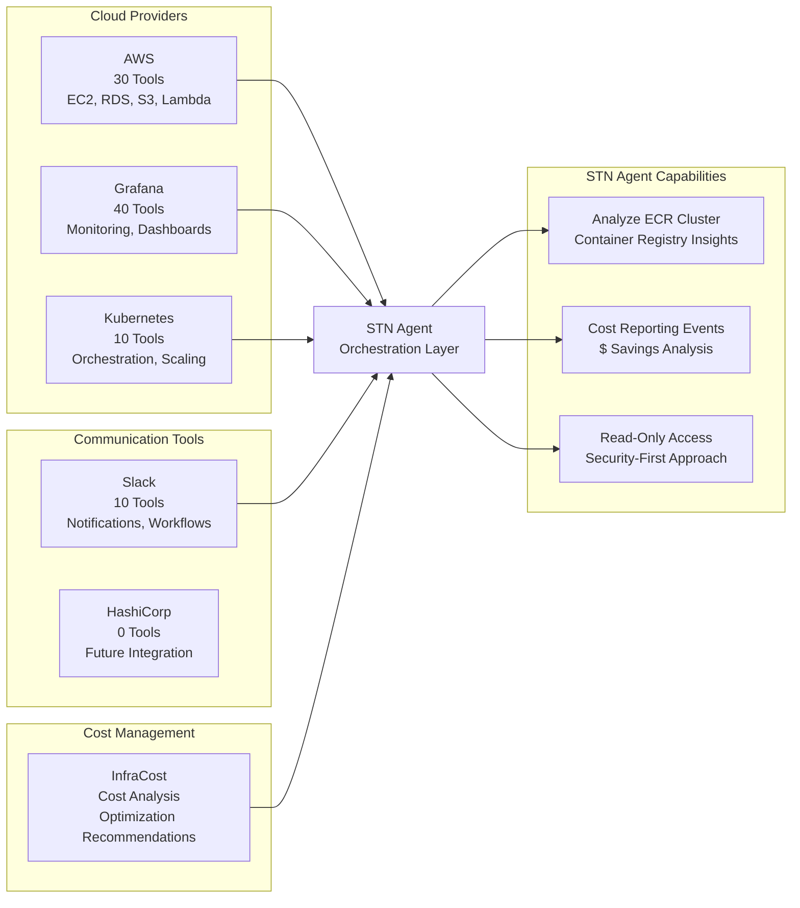
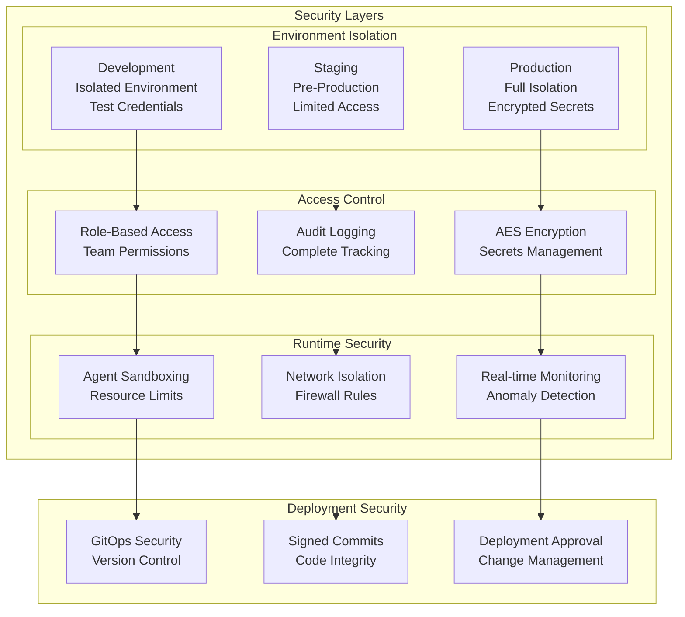
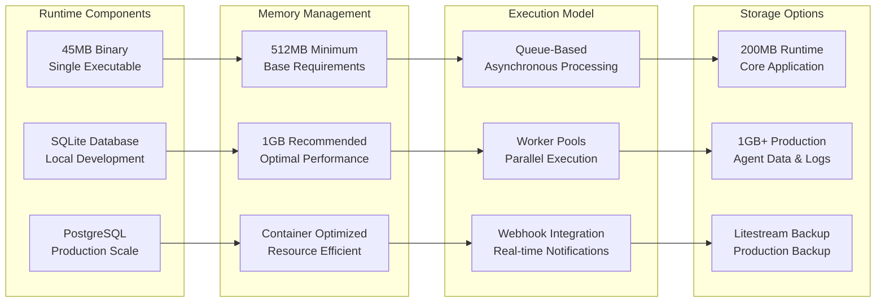
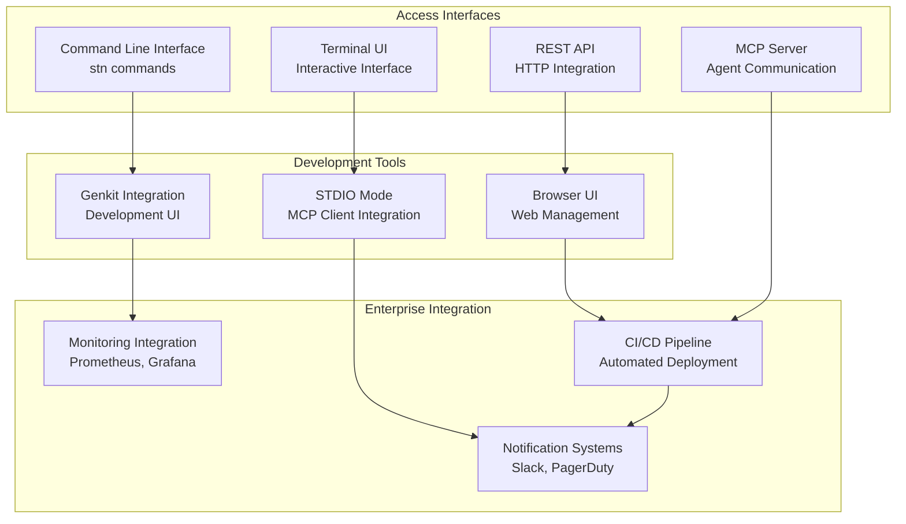

# CloudShip Station - Architecture Deep Dive

## Strategic Architecture Analysis

This document provides a comprehensive technical analysis of CloudShip Station's architecture, based on strategic whiteboard sessions and technical specifications.

## Core Architecture Overview

### 1. CloudShip AI Hub - Central Command Center

Based on **Whiteboard Image 1**, the CloudShip AI Hub serves as the central orchestration layer:

### 2. MCP Template System Architecture

Based on **Whiteboard Image 3**, the MCP Template system provides declarative tool definition across environments:

### 3. Agnostic Agent Runtime

Based on **Whiteboard Image 4**, the agnostic runtime provides Git-based deployment with MCP integration:

## Technical Implementation Strategy

### 4. Progressive Implementation Flow

Based on **Whiteboard Image 2**, the implementation follows a progressive adoption strategy:

## MCP Ecosystem Integration

### 5. Multi-Cloud Provider Tool Integration

Based on **Whiteboard Image 5**, Station integrates with comprehensive MCP toolsets:

## Security Architecture

### 6. Comprehensive Security Model

## Performance and Scalability

### 7. Lightweight Runtime Architecture

## Integration Patterns

### 8. Multi-Access Interface Architecture

## Technical Differentiators

### Key Architecture Advantages

1. **Single Binary Deployment**: 45MB executable eliminates complex dependencies
2. **Environment Isolation**: Complete separation of dev/staging/production contexts
3. **GitOps Integration**: Version-controlled agent configurations with audit trails
4. **MCP Ecosystem**: Leverage 90+ production-ready tools across cloud providers
5. **Security-First Design**: Self-hosted with AES encryption and role-based access
6. **Lightweight Runtime**: Optimized for container deployment and resource efficiency

### Competitive Technical Moats

1. **Purpose-Built for Infrastructure**: Unlike general AI platforms, Station is specifically designed for infrastructure operations
2. **Comprehensive Tool Integration**: Deep integration with DevOps, monitoring, and cloud provider toolchains
3. **Security Architecture**: Enterprise-grade security without sacrificing functionality
4. **Deployment Simplicity**: Single binary vs. complex orchestration platforms
5. **Cost Efficiency**: Self-hosted model reduces ongoing operational costs

---

This architecture analysis demonstrates CloudShip Station's technical sophistication and strategic positioning for enterprise adoption in the deployable sub-agent market.
