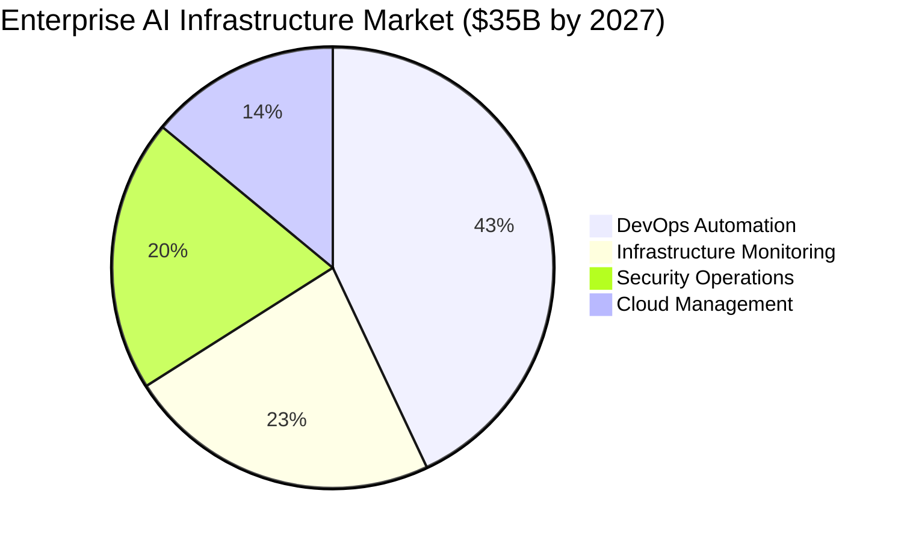
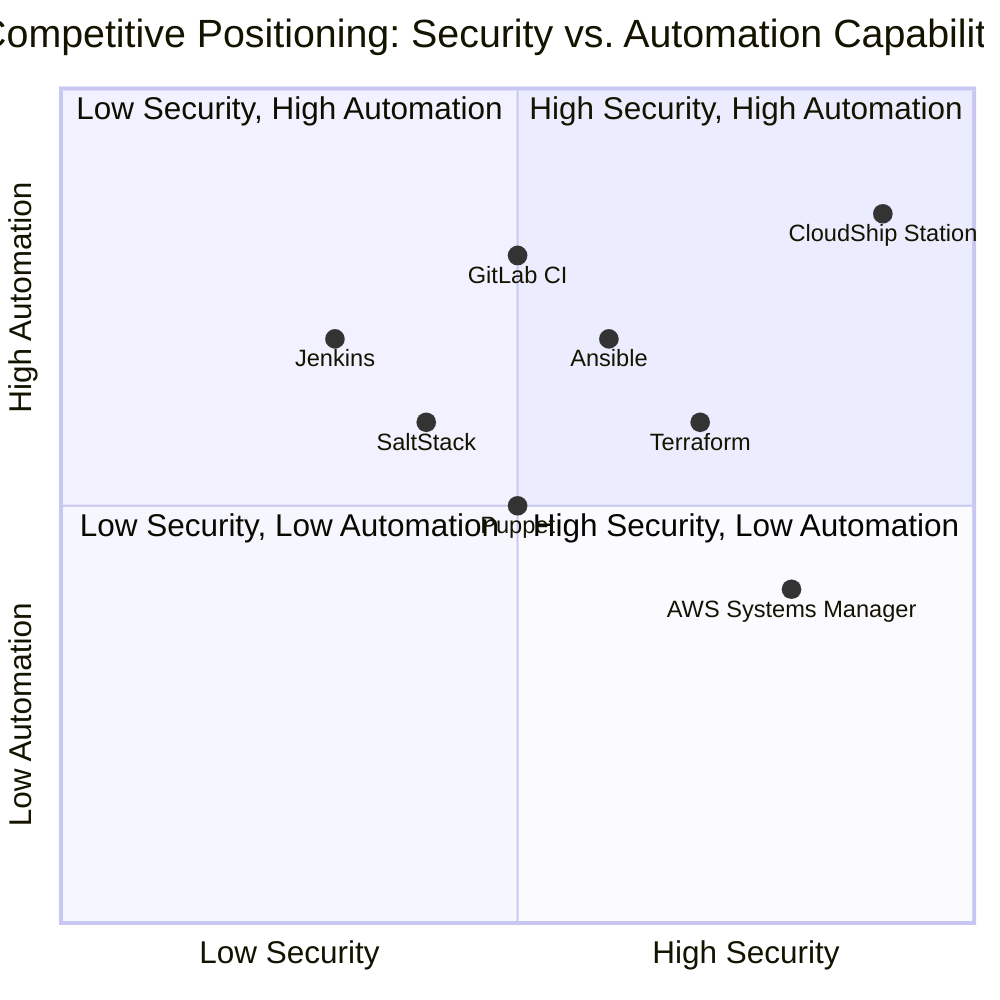
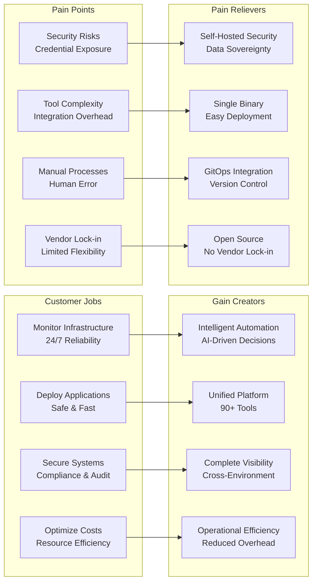
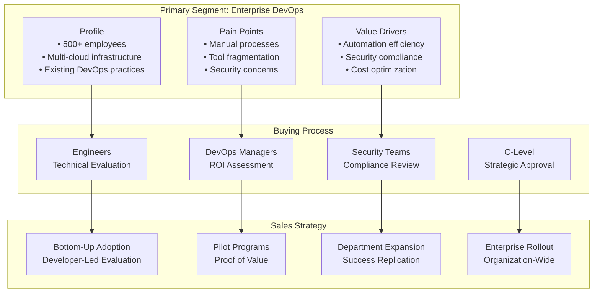
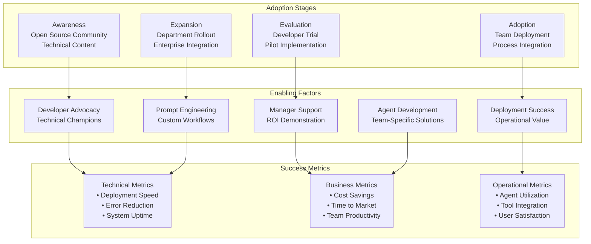
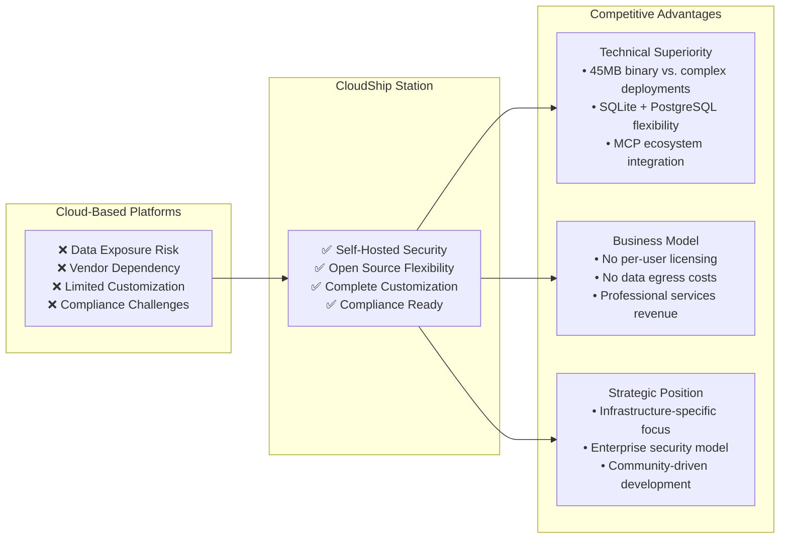
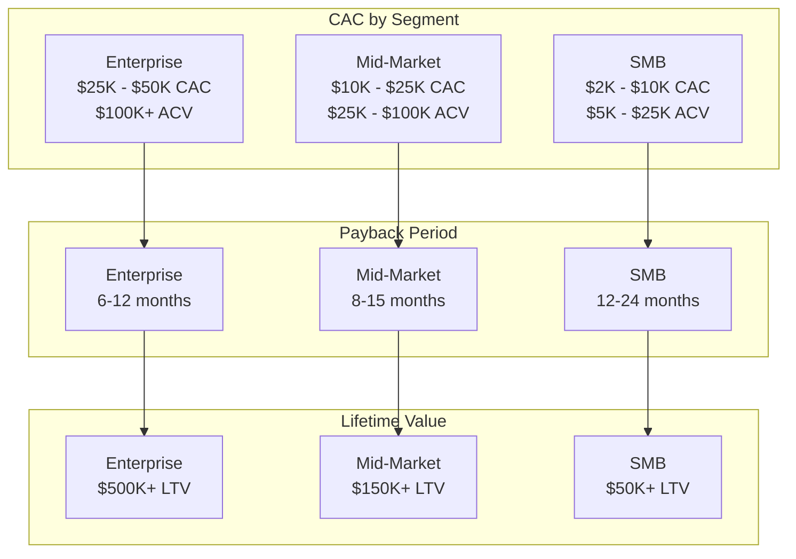

# CloudShip Station - Market Analysis

## Market Positioning and Competitive Landscape

This analysis examines CloudShip Station's strategic market position, competitive differentiation, and growth opportunities in the enterprise AI infrastructure market.

## Market Opportunity Analysis

### Total Addressable Market (TAM)

### Market Segments

#### 1. DevOps Automation Market
- **Size**: $15B TAM, $4.2B SAM
- **Growth Rate**: 23% CAGR
- **Key Players**: GitLab, GitHub Actions, Jenkins, Terraform
- **Station Opportunity**: AI-driven automation vs. static scripts

#### 2. Infrastructure Monitoring Market  
- **Size**: $8B TAM, $2.1B SAM
- **Growth Rate**: 18% CAGR
- **Key Players**: Datadog, New Relic, Prometheus, Grafana
- **Station Opportunity**: Intelligent response vs. reactive monitoring

#### 3. Security Operations Market
- **Size**: $7B TAM, $1.8B SAM  
- **Growth Rate**: 25% CAGR
- **Key Players**: Splunk, CrowdStrike, Palo Alto Networks
- **Station Opportunity**: Automated incident response vs. manual processes

#### 4. Cloud Management Market
- **Size**: $5B TAM, $1.4B SAM
- **Growth Rate**: 20% CAGR
- **Key Players**: AWS Systems Manager, Azure Arc, Google Cloud Operations
- **Station Opportunity**: Multi-cloud intelligence vs. vendor-specific tools

## Competitive Analysis Matrix

### Direct Competitors

### Competitive Differentiation Analysis

| Capability | CloudShip Station | Traditional DevOps | Cloud-Based AI | Enterprise Tools |
|------------|-------------------|-------------------|----------------|------------------|
| **Security Model** | Self-hosted, encrypted | Manual processes | Cloud-dependent | Vendor-specific |
| **Intelligence** | AI-driven decisions | Static automation | Limited context | Rule-based |
| **Deployment** | Single 45MB binary | Complex orchestration | SaaS only | Heavy infrastructure |
| **Tool Integration** | 90+ MCP tools | Tool-specific | Limited ecosystem | Proprietary |
| **Environment Isolation** | Complete separation | Manual configuration | Shared tenancy | Limited options |
| **Version Control** | GitOps native | Partial support | Cloud-hosted | Traditional SCM |

## Strategic Positioning

### Value Proposition Canvas

## Go-to-Market Strategy Analysis

### Target Customer Segments

#### Primary: Enterprise DevOps Teams

#### Secondary: Site Reliability Engineering

**Characteristics:**
- Focus on system reliability and performance
- Advanced monitoring and alerting requirements  
- Need for intelligent incident response
- Budget authority for operational tools

**Value Proposition:**
- Automated incident detection and response
- Intelligent alerting and escalation
- Performance optimization recommendations
- Comprehensive system visibility

#### Tertiary: Cloud Operations Teams

**Characteristics:**
- Multi-cloud environment management
- Cost optimization initiatives
- Security and compliance requirements
- Integration with existing toolchains

**Value Proposition:**
- Unified multi-cloud management
- Automated cost optimization
- Security policy enforcement
- Streamlined operations workflow

## Adoption Strategy Framework

### Based on Whiteboard Analysis: "Teams are willing to use AI with DEVS"

## Competitive Response Strategy

### Addressing Market Fears: "Fear of agents cloud bigger in their environment"

#### Security-First Messaging

1. **Self-Hosted Deployment**
   - Complete data sovereignty
   - No external data transmission
   - Air-gapped deployment capability

2. **Transparent Security Model**
   - Open source code review
   - Security audit compliance
   - Community-driven security improvements

3. **Gradual Adoption Path**
   - Start with read-only operations
   - Expand permissions incrementally
   - Full audit trail for compliance

#### Differentiation from Cloud-Based Solutions

## Market Entry Strategy

### Phase 1: Foundation Building (0-6 months)

**Objectives:**
- Establish technical credibility
- Build initial customer base
- Develop partner ecosystem

**Key Activities:**
- Open source community development
- Technical content marketing
- Industry conference participation
- Early adopter pilot programs

### Phase 2: Market Penetration (6-18 months)

**Objectives:**
- Scale customer acquisition
- Expand product capabilities
- Build enterprise sales pipeline

**Key Activities:**
- Enterprise sales team hiring
- Partnership development
- Product feature expansion
- Customer success programs

### Phase 3: Market Leadership (18+ months)

**Objectives:**
- Establish market leadership
- Drive industry standards
- Expand internationally

**Key Activities:**
- Strategic acquisitions
- International expansion
- Industry standard development
- Ecosystem platform launch

## Investment Requirements and ROI

### Customer Acquisition Cost (CAC) Analysis

### Market Share Projection

**Year 1**: 0.1% market share ($2.5M ARR actual projection)
**Year 3**: 0.7% market share ($25M ARR projection)  
**Year 5**: 2.5% market share ($875M ARR potential)

---

This market analysis demonstrates CloudShip Station's strong positioning to capture significant market share in the rapidly growing enterprise AI infrastructure market through differentiated security, deployment simplicity, and comprehensive tool integration.
