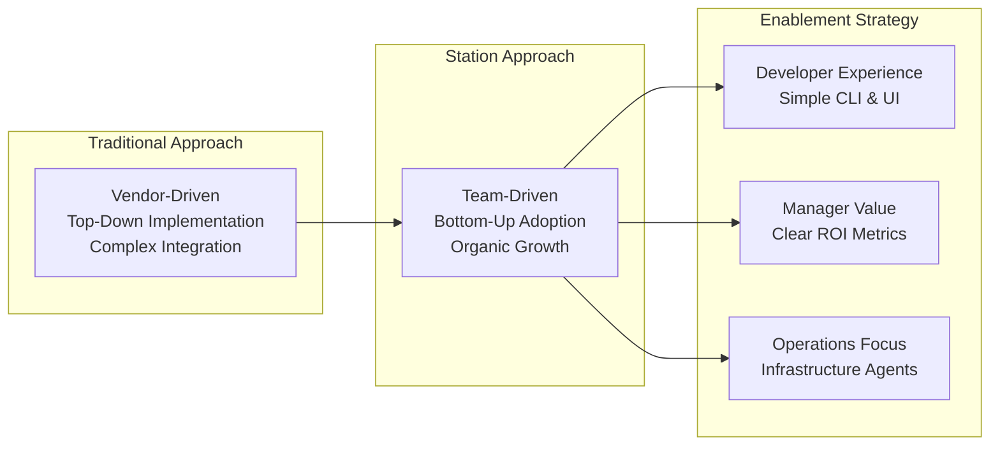
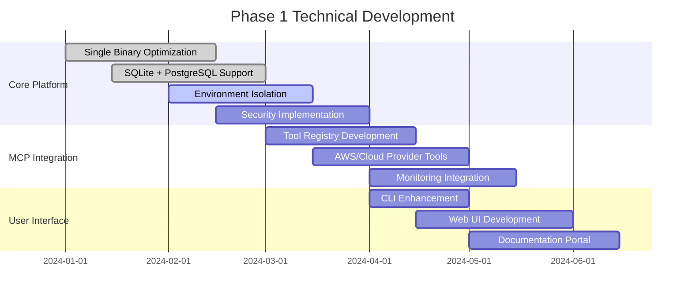
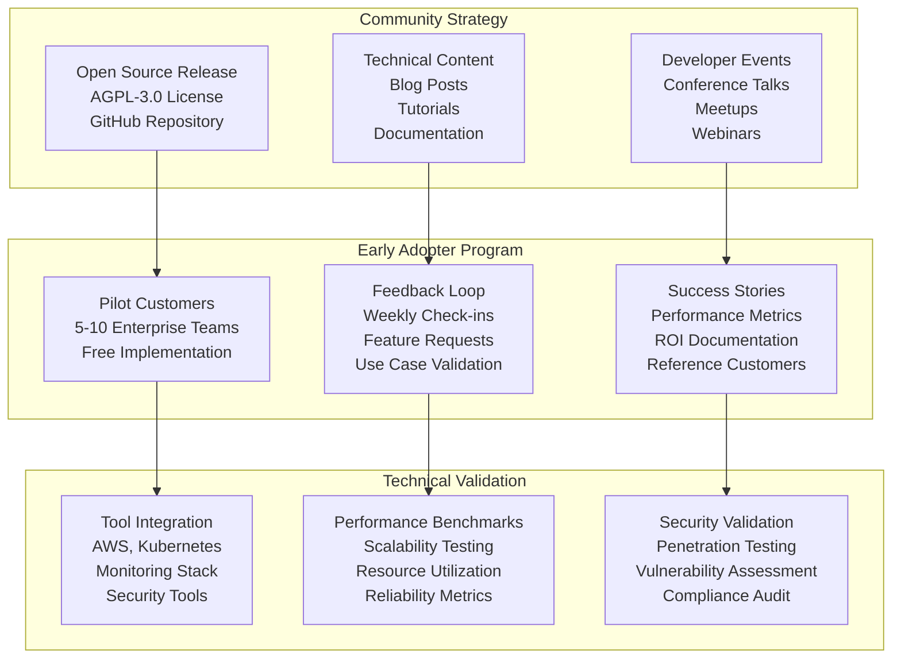
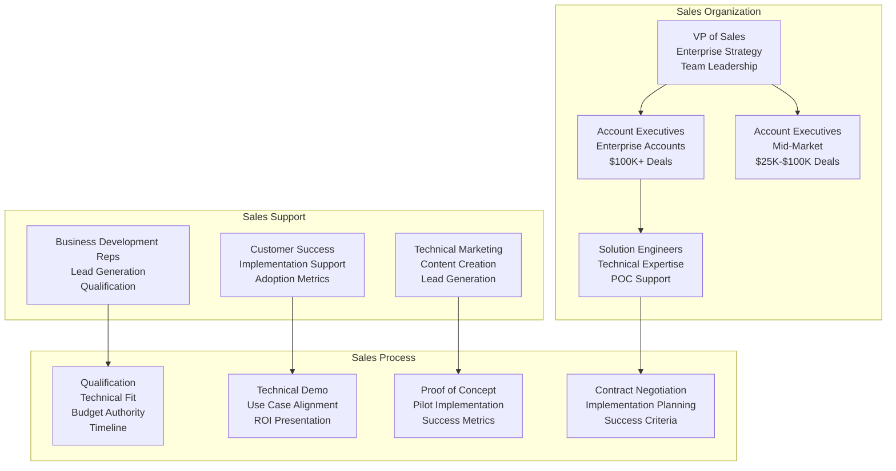
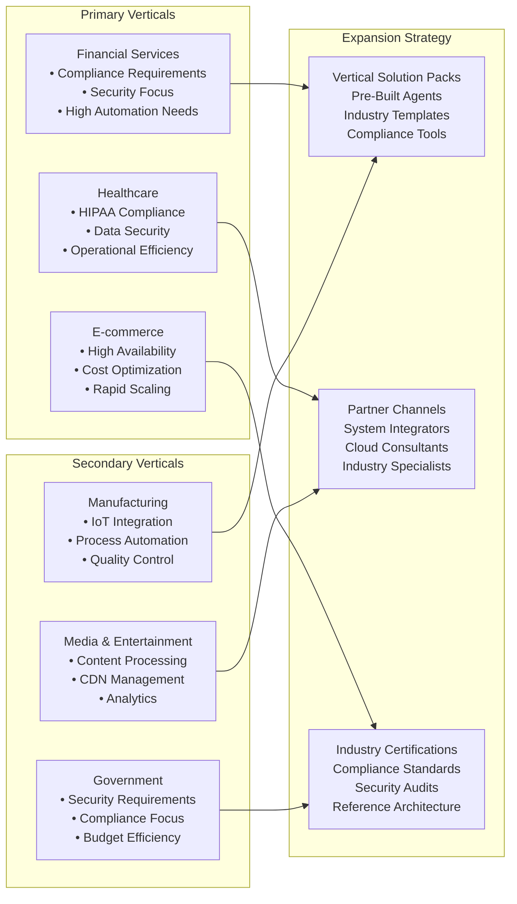
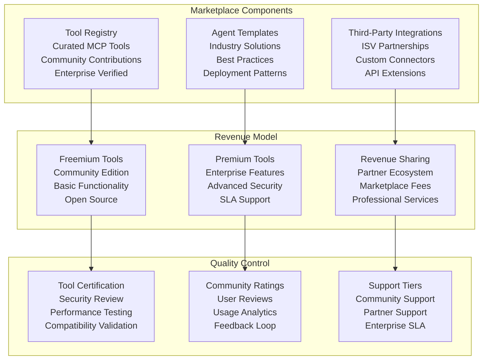
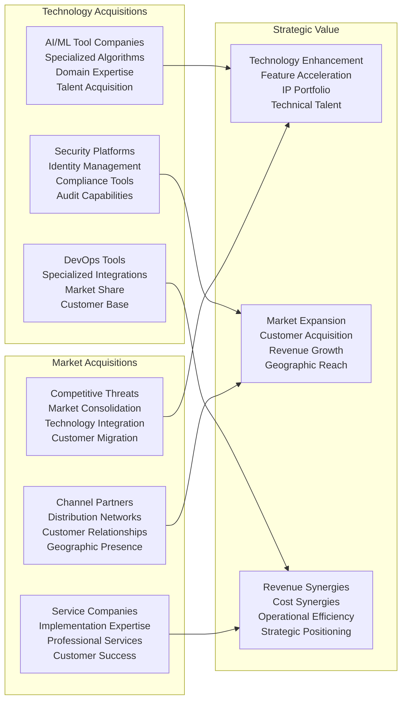

# CloudShip Station - Implementation Strategy

## Strategic Implementation Roadmap

This document outlines the comprehensive implementation strategy for CloudShip Station, based on market analysis and strategic positioning insights from the whiteboard sessions.

## Implementation Philosophy

### Core Strategy: "Empower Teams to Build and Deploy Agents"

Based on **Whiteboard Analysis**, the implementation strategy focuses on enabling teams rather than replacing them:

## Phase 1: Foundation and Early Adoption (0-6 months)

### 1.1 Technical Foundation

#### Core Platform Development

#### Security Architecture Implementation

**Priority 1: Self-Hosted Security**
- AES encryption for secrets and credentials
- Environment-specific access controls
- Complete audit logging and tracking
- GitOps integration with signed commits

**Priority 2: Compliance Framework**
- SOC 2 Type II preparation
- GDPR compliance documentation  
- Industry-specific compliance guides
- Security audit facilitation

### 1.2 Go-to-Market Foundation

#### Developer Community Building

### 1.3 Strategic Partnerships

#### Cloud Provider Integration

**AWS Partnership**
- AWS Marketplace listing
- CloudFormation templates
- IAM role integration
- Cost optimization tools

**Microsoft Azure Partnership**
- Azure Marketplace presence
- ARM template development
- Azure Active Directory integration
- Azure Monitor connectivity

**Google Cloud Partnership**
- GCP Marketplace listing
- Deployment Manager templates
- Google Cloud IAM integration
- Stackdriver monitoring

#### DevOps Tool Ecosystem

**CI/CD Integration**
- GitHub Actions marketplace
- GitLab CI/CD templates
- Jenkins plugin development
- Azure DevOps extensions

**Monitoring Platform Integration**
- Prometheus operator
- Grafana plugin development
- Datadog integration
- New Relic connectivity

## Phase 2: Market Penetration (6-18 months)

### 2.1 Enterprise Sales Development

#### Sales Team Structure

#### Customer Success Framework

**Implementation Methodology**

```mermaid
flowchart LR
    subgraph "Week 1-2: Setup"
        INSTALL[Environment Setup<br/>Binary Installation<br/>Initial Configuration]
        
        CONNECT[Tool Integration<br/>Cloud Provider Setup<br/>Monitoring Connection]
    end
    
    subgraph "Week 3-4: First Agent"
        AGENT1[Create First Agent<br/>Simple Monitoring Task<br/>Success Validation]
        
        TEMPLATE[Template Development<br/>Team-Specific Configuration<br/>Variable Management]
    end
    
    subgraph "Week 5-8: Expansion"
        MULTI_AGENT[Multiple Agents<br/>Complex Workflows<br/>Cross-Team Coordination]
        
        PRODUCTION[Production Deployment<br/>Security Hardening<br/>Performance Optimization]
    end
    
    subgraph "Week 9-12: Optimization"
        ADVANCED[Advanced Features<br/>Custom Integrations<br/>Workflow Automation]
        
        SCALE[Team Scaling<br/>Department Expansion<br/>Best Practices]
    end
    
    INSTALL --> CONNECT
    CONNECT --> AGENT1
    AGENT1 --> TEMPLATE
    TEMPLATE --> MULTI_AGENT
    MULTI_AGENT --> PRODUCTION
    PRODUCTION --> ADVANCED
    ADVANCED --> SCALE
```

### 2.2 Product Development Expansion

#### Feature Roadmap

**Quarter 1-2 Features**
- Advanced security controls
- Multi-tenancy support
- Enhanced monitoring and alerting
- Custom MCP tool development framework

**Quarter 3-4 Features**
- AI model integration options
- Advanced workflow orchestration
- Enterprise SSO integration
- Compliance dashboard

**Year 2 Features**
- Multi-region deployment
- Edge computing support
- Advanced analytics and ML
- Marketplace platform

### 2.3 Market Expansion Strategy

#### Vertical Market Penetration

## Phase 3: Market Leadership (18+ months)

### 3.1 Platform Strategy

#### Ecosystem Development

**MCP Marketplace Platform**

### 3.2 International Expansion

#### Geographic Rollout Strategy

**Phase 1: English-Speaking Markets**
- Canada: Similar regulatory environment
- UK: Strong DevOps culture, GDPR experience
- Australia: Growing tech sector, cloud adoption

**Phase 2: European Union**
- Germany: Large enterprise market, engineering culture
- Netherlands: Cloud infrastructure hub
- France: Government and enterprise adoption

**Phase 3: Asia-Pacific**
- Japan: Enterprise technology adoption
- Singapore: Regional hub, financial services
- South Korea: Advanced technology infrastructure

### 3.3 Strategic Acquisitions

#### Target Acquisition Categories

## Success Metrics and KPIs

### Implementation Success Tracking

#### Phase 1 Metrics (0-6 months)

**Technical Metrics**
- GitHub stars and forks
- Community contributions
- Tool integrations completed
- Security audit completion

**Business Metrics**
- Pilot customer acquisitions (target: 10)
- Developer community size (target: 1,000)
- Monthly active installations (target: 100)
- Customer satisfaction score (target: 8.5/10)

#### Phase 2 Metrics (6-18 months)

**Growth Metrics**
- Annual Recurring Revenue (target: $5M)
- Customer count (target: 50 enterprise)
- Average deal size (target: $50K)
- Sales team productivity (target: $1M ARR per AE)

**Product Metrics**
- Feature adoption rates (target: 80% core features)
- Customer churn rate (target: <5% annually)
- Net Promoter Score (target: 50+)
- Support ticket resolution (target: <24 hours)

#### Phase 3 Metrics (18+ months)

**Market Leadership Metrics**
- Market share in target segments (target: 5%)
- Brand awareness in enterprise DevOps (target: 50%)
- Analyst recognition (Gartner, Forrester positioning)
- Industry partnership count (target: 20+)

**Financial Metrics**
- Annual Recurring Revenue (target: $50M)
- Gross margin (target: 85%+)
- Customer Lifetime Value (target: $500K+)
- Path to profitability (target: 24 months)

## Risk Mitigation Strategy

### Technical Risks

**Security Vulnerabilities**
- Continuous security testing
- Bug bounty program
- Third-party security audits
- Rapid response protocols

**Scalability Challenges**
- Performance testing framework
- Load testing automation
- Architecture review process
- Cloud-native optimization

### Market Risks

**Competitive Response**
- Feature differentiation strategy
- Patent protection program
- Customer lock-in through value
- Community ecosystem development

**Economic Downturn**
- Cost optimization focus
- Flexible pricing models
- Strong unit economics
- Diverse customer base

### Execution Risks

**Team Scaling**
- Structured hiring process
- Culture preservation
- Knowledge management
- Succession planning

**Partnership Dependencies**
- Diversified partner portfolio
- Direct sales capability
- Technology independence
- Alternative channel development

---

This implementation strategy provides a comprehensive roadmap for CloudShip Station's market penetration and leadership achievement, based on the strategic insights from whiteboard analysis and market positioning assessment.
