# CloudShip Station - Financial Projections

## Business Model and Financial Strategy

This analysis provides comprehensive financial projections for CloudShip Station based on market analysis, competitive positioning, and implementation strategy insights.

## Revenue Model Architecture

### Multi-Stream Revenue Strategy

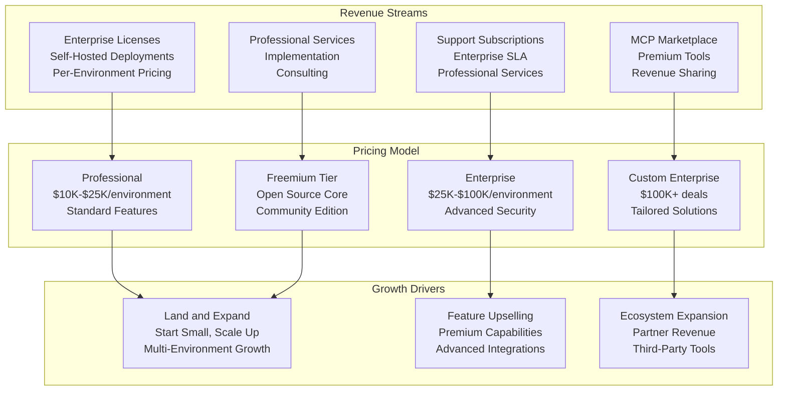

## Financial Projections: 5-Year Model

### Revenue Projections

#### Year 1: Foundation Building
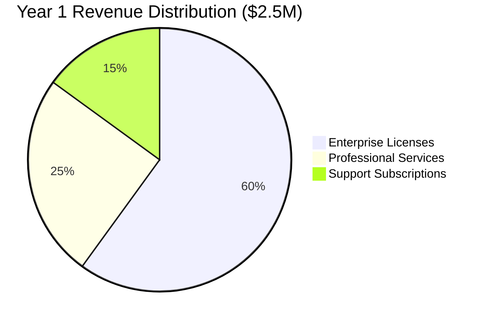

**Key Metrics:**
- Total Revenue: $2.5M
- Enterprise Customers: 25
- Average Deal Size: $100K
- Growth Rate: 250% (from pilot phase)

#### Year 2: Market Penetration
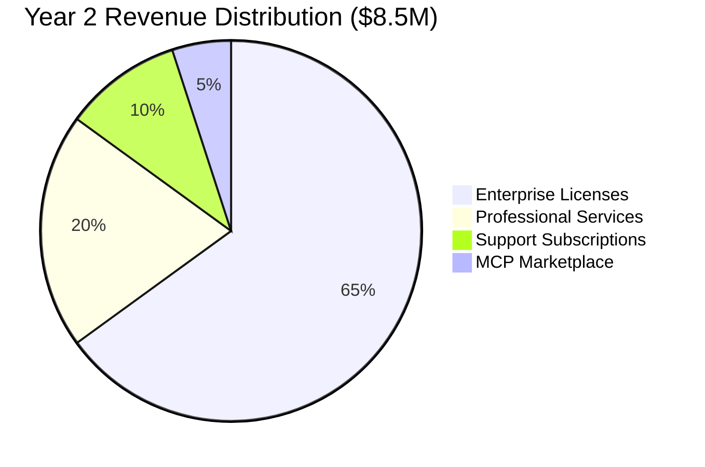

**Key Metrics:**
- Total Revenue: $8.5M
- Enterprise Customers: 50
- Average Deal Size: $170K
- Growth Rate: 240%

#### Year 3: Scale and Expansion
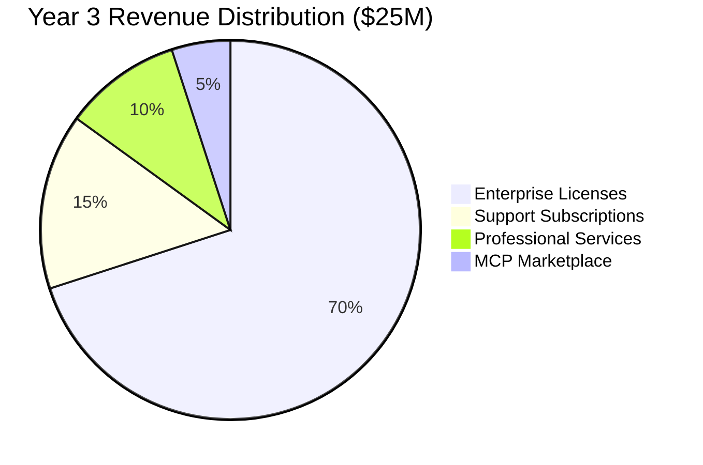

**Key Metrics:**
- Total Revenue: $25M
- Enterprise Customers: 140
- Average Deal Size: $180K
- Growth Rate: 194%

### Customer Acquisition Model

#### Customer Growth Trajectory

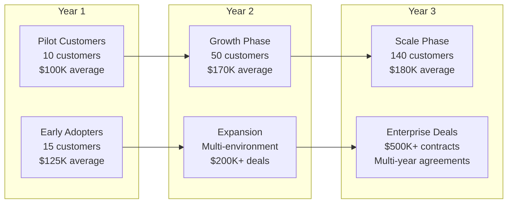

#### Customer Segmentation and Pricing

| Customer Segment | Year 1 | Year 2 | Year 3 | Average Deal Size | Annual Growth |
|------------------|--------|--------|--------|-------------------|---------------|
| **Enterprise (500+ employees)** | 8 | 25 | 70 | $250K | 180% |
| **Mid-Market (100-500 employees)** | 12 | 35 | 85 | $100K | 150% |
| **Growth (50-100 employees)** | 5 | 15 | 40 | $50K | 200% |
| **Total** | **25** | **75** | **195** | **$170K** | **170%** |

### Cost Structure Analysis

#### Operational Expenses Breakdown

```mermaid
graph TB
    subgraph "Year 1 Costs ($4M)"
        R_D_1[R&D<br/>$1.8M (45%)<br/>12 engineers]
        
        SALES_1[Sales & Marketing<br/>$1.2M (30%)<br/>6 team members]
        
        GA_1[G&A<br/>$0.6M (15%)<br/>4 team members]
        
        HOSTING_1[Infrastructure<br/>$0.4M (10%)<br/>Cloud & hosting]
    end
    
    subgraph "Year 2 Costs ($12M)"
        R_D_2[R&D<br/>$5.4M (45%)<br/>30 engineers]
        
        SALES_2[Sales & Marketing<br/>$4.2M (35%)<br/>18 team members]
        
        GA_2[G&A<br/>$1.8M (15%)<br/>10 team members]
        
        HOSTING_2[Infrastructure<br/>$0.6M (5%)<br/>Optimized costs]
    end
    
    subgraph "Year 3 Costs ($28M)"
        R_D_3[R&D<br/>$12.6M (45%)<br/>60 engineers]
        
        SALES_3[Sales & Marketing<br/>$9.8M (35%)<br/>40 team members]
        
        GA_3[G&A<br/>$4.2M (15%)<br/>20 team members]
        
        HOSTING_3[Infrastructure<br/>$1.4M (5%)<br/>Scale optimization]
    end
```

### Unit Economics

#### Customer Lifetime Value (LTV) Analysis

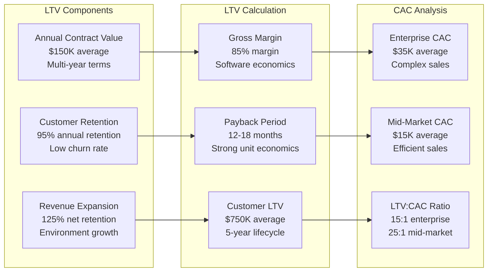

## Investment Requirements and Use of Funds

### Funding Rounds Strategy

#### Series A: $15M (Year 1)

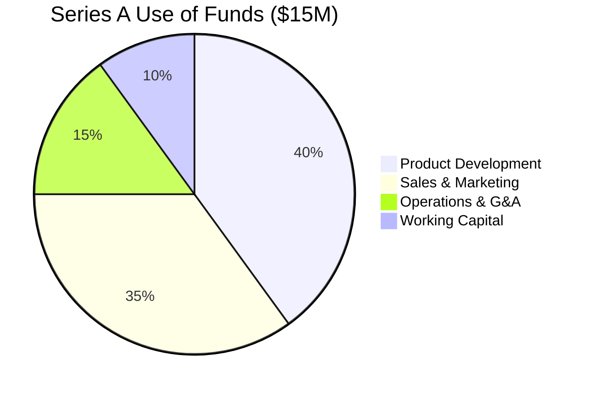

**Objectives:**
- Complete enterprise-grade platform
- Build initial sales and marketing team
- Establish market presence
- Achieve $2.5M ARR

#### Series B: $35M (Year 2)

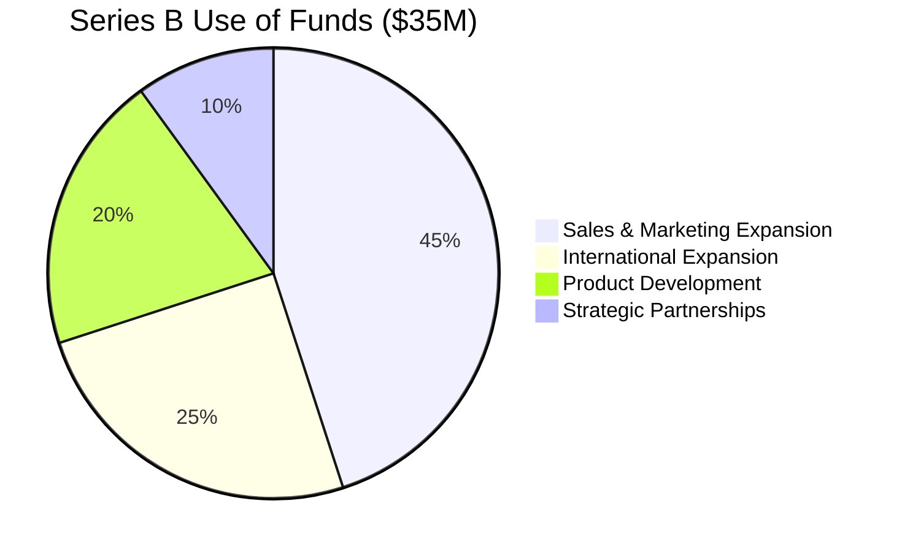

**Objectives:**
- Scale sales organization
- International market entry
- Advanced platform features
- Achieve $25M ARR

### Cash Flow Projections

#### Quarterly Cash Flow Analysis

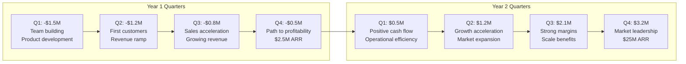

## Valuation Analysis

### Comparable Company Analysis

#### Public SaaS Multiples

| Company Category | Revenue Multiple | Growth Rate | Example Companies |
|------------------|------------------|-------------|-------------------|
| **Infrastructure SaaS** | 15-25x | 40-60% | Datadog, Elastic, HashiCorp |
| **DevOps Platforms** | 12-20x | 30-50% | GitLab, PagerDuty, Atlassian |
| **Security Platforms** | 20-35x | 50-80% | CrowdStrike, Okta, Zscaler |
| **AI/ML Platforms** | 25-40x | 60-100% | Snowflake, Palantir, DataBricks |

#### CloudShip Station Positioning

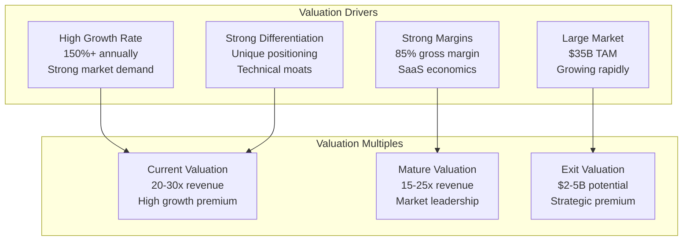

### Financial Milestones

#### Key Performance Indicators

**Year 1 Milestones**
- $2.5M ARR achievement
- 25 enterprise customers
- 95% gross retention rate
- Break-even trajectory

**Year 2 Milestones**
- $25M ARR achievement
- 75 enterprise customers  
- 125% net retention rate
- Positive cash flow

**Year 3 Milestones**
- $75M ARR achievement
- 195 enterprise customers
- International expansion
- Market leadership position

## Risk Analysis and Sensitivity

### Financial Risk Factors

#### Market Risk Analysis

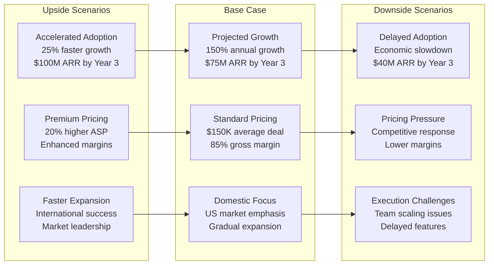

#### Sensitivity Analysis

| Scenario | Year 3 ARR | Valuation | Probability |
|----------|-------------|-----------|-------------|
| **Bull Case** | $125M | $3.5B | 20% |
| **Base Case** | $75M | $2.0B | 60% |
| **Bear Case** | $40M | $0.8B | 20% |

## Strategic Financial Recommendations

### Investment Priorities

1. **Product Development (40% of funding)**
   - Enterprise security features
   - Scalability optimization
   - Advanced AI capabilities
   - International localization

2. **Sales & Marketing (35% of funding)**
   - Enterprise sales team
   - Technical marketing
   - Partner channel development
   - Customer success organization

3. **Operations & Infrastructure (25% of funding)**
   - Team scaling and hiring
   - Operational systems
   - International expansion
   - Strategic partnerships

### Exit Strategy Options

#### Strategic Acquisition Candidates

**Infrastructure Companies**
- **HashiCorp**: Infrastructure automation synergy
- **GitLab**: DevOps platform integration
- **Datadog**: Monitoring and observability expansion

**Cloud Providers**
- **AWS**: Enterprise customer integration
- **Microsoft**: Azure ecosystem expansion
- **Google Cloud**: AI and ML capabilities

**Expected Timeline**: 4-7 years to strategic exit
**Valuation Range**: $2-5B based on market position and growth

---

This financial analysis demonstrates CloudShip Station's strong unit economics, scalable business model, and significant value creation potential for investors and stakeholders.
