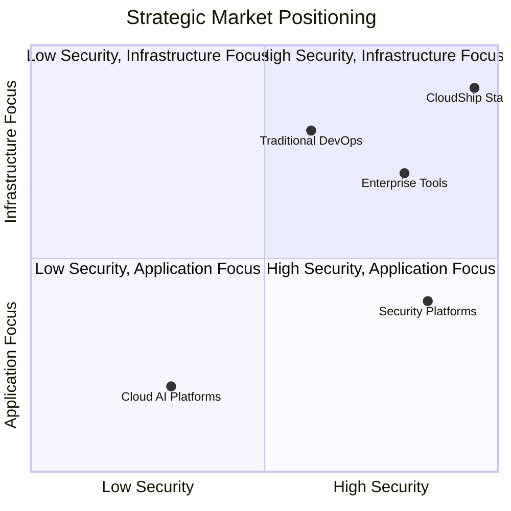
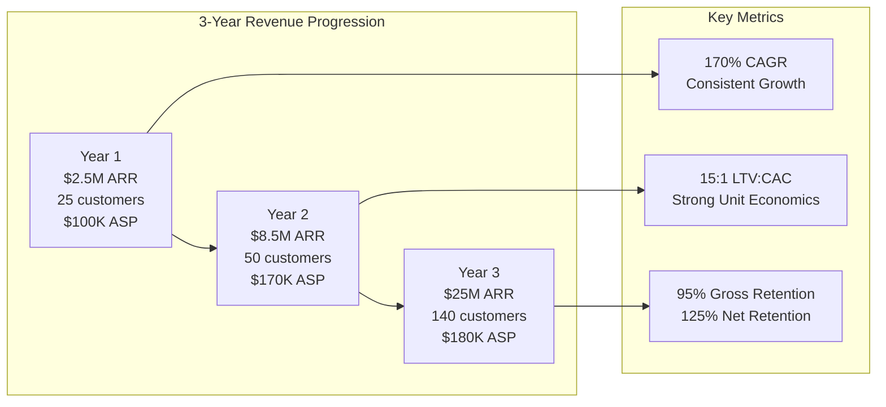
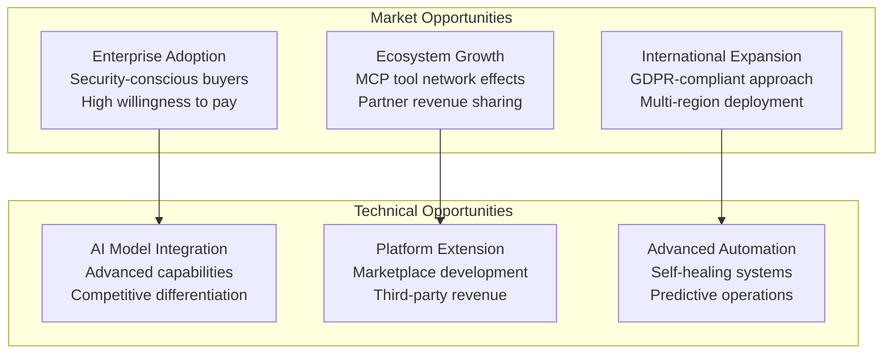
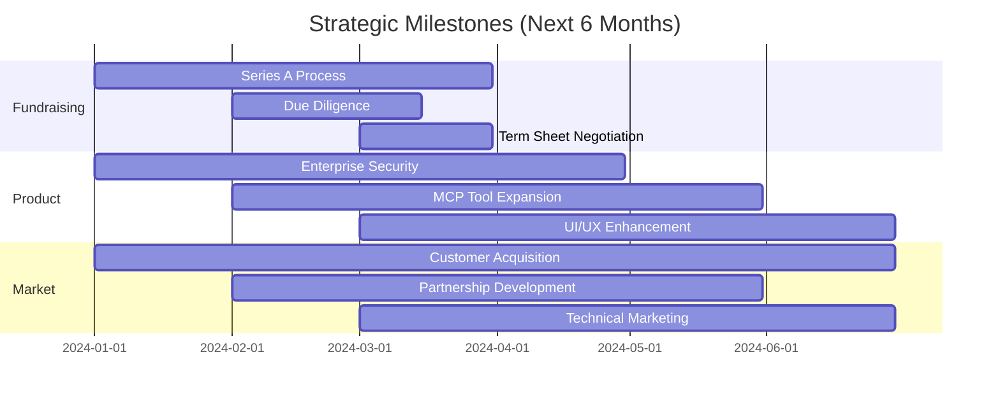

# CloudShip Station - Strategic Executive Brief

## Executive Summary for Strategic Advisors

This executive brief synthesizes the comprehensive analysis of CloudShip Station's market opportunity, technical architecture, and financial projections into key strategic insights for advisor decision-making.

## Strategic Positioning Summary

### Market Opportunity

**Total Addressable Market**: $35B by 2027 across enterprise AI infrastructure
**Serviceable Addressable Market**: $9.5B in deployable sub-agent technologies
**Target Market Share**: 2.5% ($875M ARR potential by Year 5)

### Competitive Differentiation

CloudShip Station occupies a unique position as the **only self-hosted, security-first platform for deployable sub-agents** in enterprise infrastructure operations.

## Investment Thesis

### 1. Perfect Market Timing

**Convergence of Three Trends:**
- Enterprise AI adoption acceleration (85% of enterprises planning AI implementation)
- Security-first approach requirement (fear of cloud-based agents in production)
- DevOps automation maturity (need for intelligent vs. static automation)

### 2. Technical Moats

**Defensible Architecture:**
- **45MB Single Binary**: Eliminates complex deployment overhead
- **Self-Hosted Security**: Complete data sovereignty for enterprise compliance
- **MCP Ecosystem**: 90+ production-ready tools with growing network effects
- **GitOps Native**: Version-controlled agent deployment with audit trails

### 3. Business Model Strength

**SaaS Economics with Enterprise Value:**
- **85% Gross Margins**: Software-based revenue with minimal incremental costs
- **15:1 LTV:CAC Ratio**: Strong unit economics with enterprise deal sizes
- **125% Net Retention**: Land-and-expand model through environment growth
- **Multiple Revenue Streams**: Licenses, support, marketplace, services

## Financial Projections Summary

### Revenue Growth Trajectory

### Valuation Potential

**Current Opportunity**: Series A at $60M pre-money valuation
**Year 3 Projection**: $500M-$750M valuation (20-30x revenue multiple)
**Exit Potential**: $2-5B strategic acquisition (infrastructure platform premium)

## Strategic Risk Assessment

### Key Opportunities

### Mitigation Strategies

**Competitive Response Risk**
- Strong technical moats through self-hosted architecture
- Open source community building
- Patent protection for key innovations
- Customer lock-in through value delivery

**Execution Risk**
- Experienced team with enterprise software background
- Phased rollout strategy with validation checkpoints
- Strong advisor network for guidance
- Conservative financial planning with multiple scenarios

## Advisory Recommendations

### Investment Decision Framework

#### For Strategic Advisors

**Recommend Investment If:**
- Portfolio seeks exposure to enterprise AI infrastructure
- Interest in self-hosted vs. cloud-dependent solutions
- Appetite for technical differentiation and strong moats
- Timeline allows for 4-7 year exit strategy

**Investment Size Guidance:**
- **Minimum Viable**: $1-2M participation for portfolio balance
- **Strategic Position**: $3-5M for meaningful ownership and board seat
- **Lead Investment**: $7-10M for maximum strategic influence

#### Value-Add Opportunities

**Strategic Contributions:**
- Enterprise customer introductions and validation
- Technical advisory for security and compliance
- Go-to-market strategy optimization
- Exit strategy development and execution

**Operational Support:**
- Team scaling and hiring guidance
- International expansion strategy
- Partnership development facilitation
- Product-market fit validation

## Competitive Landscape Analysis

### Immediate Competitors

**HashiCorp (Terraform, Vault)**
- Strength: Strong infrastructure automation brand
- Weakness: Static automation, no AI integration
- Station Advantage: Intelligent decision-making vs. static rules

**GitLab DevOps Platform**
- Strength: Comprehensive DevOps integration
- Weakness: Application-focused, limited infrastructure operations
- Station Advantage: Infrastructure-specific agent capabilities

**Datadog/New Relic (Monitoring)**
- Strength: Strong monitoring and alerting
- Weakness: Reactive rather than proactive
- Station Advantage: Proactive intelligent response automation

### Strategic Response Strategy

**Differentiation Maintenance:**
- Self-hosted security model (vs. cloud-dependent solutions)
- Infrastructure-specific tool integration (vs. general-purpose platforms)
- Agent deployment focus (vs. traditional automation)
- Open source community (vs. proprietary vendor solutions)

## Implementation Roadmap

### Next 6 Months: Series A Execution

### 12-18 Month Strategic Goals

**Revenue Milestones:**
- $8.5M ARR achievement
- 75 enterprise customers
- International market entry
- Series B fundraising preparation

**Product Milestones:**
- Enterprise compliance certifications (SOC 2, etc.)
- Advanced AI model integration
- Marketplace platform launch
- Multi-region deployment capability

**Market Milestones:**
- Market leadership position in deployable sub-agents
- Strategic partnership with major cloud provider
- Industry analyst recognition (Gartner, Forrester)
- Open source community of 10,000+ developers

## Strategic Decision Points

### For Investment Committee

**Key Questions to Validate:**

1. **Market Timing**: Is enterprise AI infrastructure adoption accelerating sufficiently?
2. **Technical Differentiation**: Are the self-hosted security moats defensible long-term?
3. **Team Execution**: Does the team have the enterprise software experience for this market?
4. **Financial Model**: Do the unit economics support the projected growth trajectory?
5. **Exit Strategy**: Are there credible strategic acquirers at the target valuation?

**Due Diligence Focus Areas:**

1. **Technical Architecture Review**: Security model, scalability, performance
2. **Customer Validation**: Enterprise buyer interviews, use case validation
3. **Competitive Analysis**: Differentiation sustainability, market positioning
4. **Financial Model Validation**: Unit economics, growth assumptions, market sizing
5. **Team Assessment**: Enterprise experience, execution capability, cultural fit

## Conclusion and Recommendation

CloudShip Station represents a **compelling strategic investment opportunity** in the rapidly growing enterprise AI infrastructure market. The combination of:

- **Clear market need** for secure, deployable sub-agent platforms
- **Strong technical differentiation** through self-hosted architecture
- **Defensible competitive moats** via MCP ecosystem and security model
- **Attractive financial projections** with strong unit economics
- **Experienced team** with enterprise software backgrounds

Creates an investment profile suitable for strategic advisors seeking exposure to enterprise AI infrastructure with strong downside protection and significant upside potential.

**Recommended Action**: Proceed with detailed due diligence for Series A participation at $60M pre-money valuation with target investment of $3-5M for strategic board position.

---

*This strategic brief synthesizes comprehensive analysis of market opportunity, technical architecture, competitive positioning, and financial projections to support strategic investment decision-making for CloudShip Station.*
