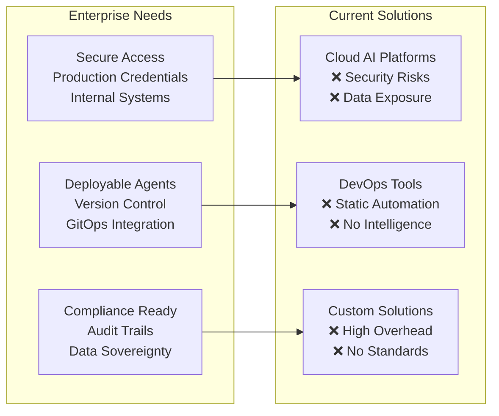
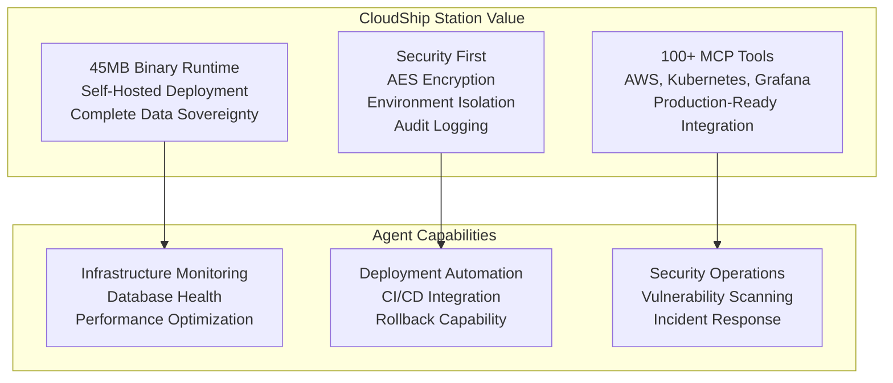
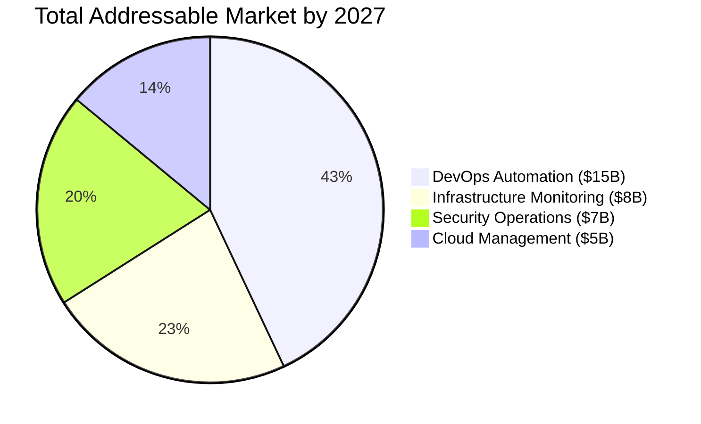
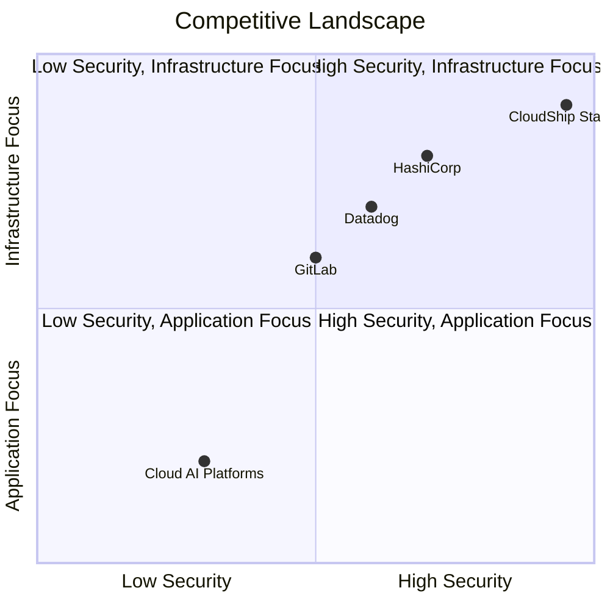
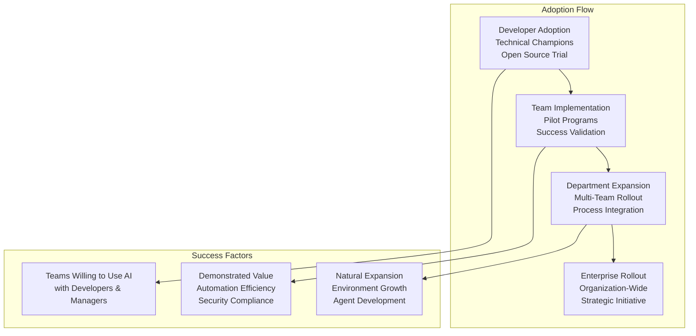
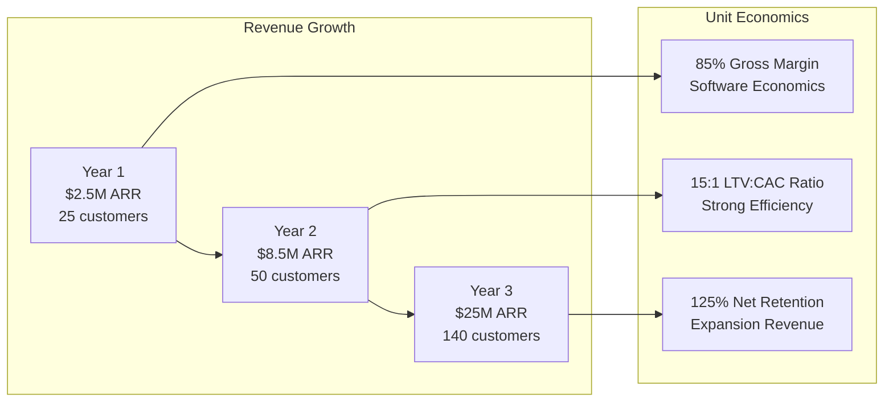
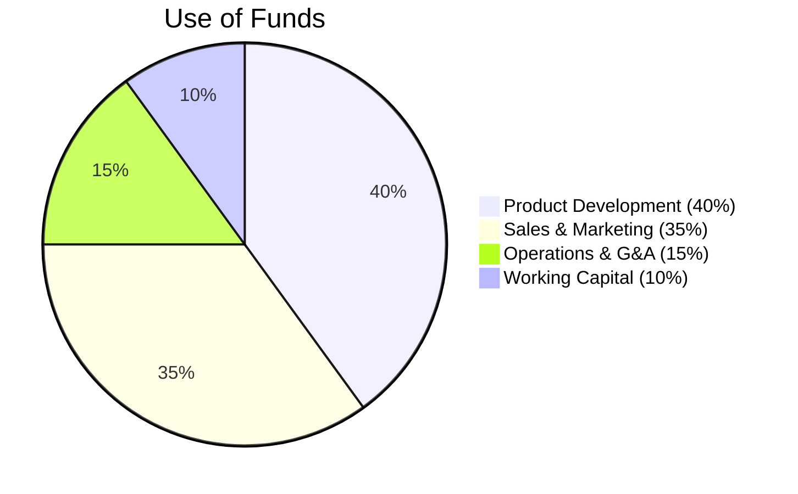
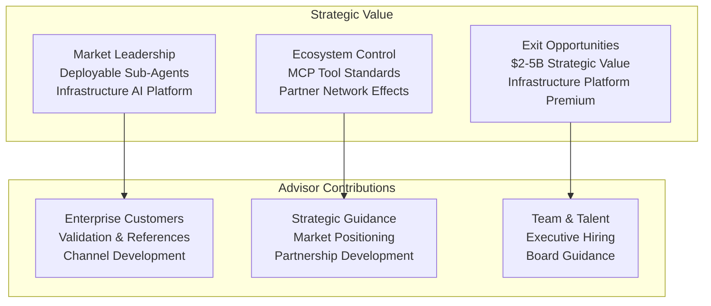
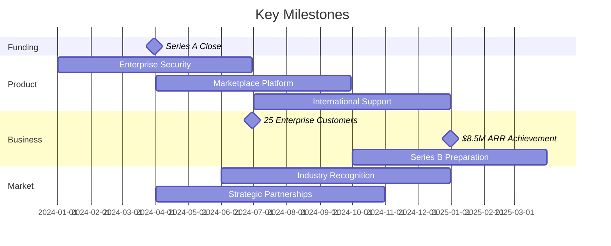

# CloudShip Station - Strategic Advisor Presentation Deck

## Slide Deck Overview

This presentation deck synthesizes the comprehensive analysis into a focused advisor presentation format.

---

## Slide 1: Title Slide

# CloudShip Station
## Lightweight Runtime for Deployable Sub-Agents

**Strategic Advisor Presentation**
*Secure, Self-Hosted AI Infrastructure Platform*

---

## Slide 2: The Problem - Enterprise AI Infrastructure Gap

### Current Enterprise Challenge



**Key Insight**: *"Fear of agents cloud bigger in their environment"* - Enterprises want AI but need local control

---

## Slide 3: The Solution - Self-Hosted Agent Platform

### CloudShip Station: Purpose-Built for Infrastructure



**Value Proposition**: Secure, deployable sub-agents for enterprise infrastructure operations

---

## Slide 4: Market Opportunity

### $35B Enterprise AI Infrastructure Market



**Growth Drivers**:
- 85% of enterprises planning AI implementation
- Security-first approach requirement
- DevOps automation maturity needs

**Target Market Share**: 2.5% = $875M ARR potential

---

## Slide 5: Competitive Differentiation

### Unique Positioning: Self-Hosted Infrastructure AI



**Key Differentiators**:
- Only self-hosted deployable agent platform
- Infrastructure-specific tool integration
- Security-first architecture
- Open source with enterprise features

---

## Slide 6: Architecture Overview

### Technical Foundation

```mermaid
graph TB
    subgraph "CloudShip AI Hub"
        ANALYTICS[Analytics & Management<br/>Cross-Environment Visibility<br/>Team-Defined Secrets]
    end
    
    subgraph "Deployment Environments"
        DEV[Development<br/>STN Runtime]
        STAGE[Staging<br/>STN Runtime]  
        PROD[Production<br/>STN Runtime]
    end
    
    subgraph "MCP Tool Ecosystem"
        AWS[AWS Tools (30)<br/>EC2, RDS, Lambda]
        K8S[Kubernetes (10)<br/>Orchestration]
        MONITOR[Monitoring (40)<br/>Grafana, Prometheus]
        COMMS[Communications (10)<br/>Slack, PagerDuty]
    end
    
    ANALYTICS --> DEV
    ANALYTICS --> STAGE
    ANALYTICS --> PROD
    
    DEV --> AWS
    STAGE --> K8S
    PROD --> MONITOR
    PROD --> COMMS
```

**Technical Advantages**: Single binary, environment isolation, comprehensive tool integration

---

## Slide 7: Go-to-Market Strategy

### Bottom-Up Enterprise Adoption



**Strategy**: Start with developers, prove value, expand through organizations

---

## Slide 8: Financial Projections

### Strong SaaS Economics with Enterprise Value



**Key Metrics**: 170% CAGR, $170K average deal size, enterprise-grade retention

---

## Slide 9: Investment Opportunity

### Series A: $15M at $60M Pre-Money



**Investment Highlights**:
- **Strong Unit Economics**: 15:1 LTV:CAC with 85% margins
- **Defensible Moats**: Self-hosted architecture, MCP ecosystem
- **Large Market**: $35B TAM with 150%+ growth opportunity
- **Experienced Team**: Enterprise software and infrastructure expertise

**Projected Valuation**: $500M-$750M by Year 3 (20-30x revenue multiple)

---

## Slide 10: Strategic Value for Advisors

### Value Creation Opportunities



**Strategic Acquirer Profile**: HashiCorp, GitLab, Datadog, AWS, Microsoft, Google Cloud

---

## Slide 11: Risk Assessment & Mitigation

### Balanced Risk Profile

| Risk Category | Risk Level | Mitigation Strategy |
|---------------|------------|-------------------|
| **Market Adoption** | Medium | Bottom-up adoption, pilot programs |
| **Competitive Response** | Medium | Technical moats, open source community |
| **Execution Risk** | Low | Experienced team, phased approach |
| **Technology Risk** | Low | Proven architecture, security focus |
| **Financial Risk** | Low | Strong unit economics, multiple revenue streams |

**Overall Assessment**: **Low-to-Medium Risk** with **High Reward Potential**

---

## Slide 12: Timeline & Milestones

### 18-Month Strategic Roadmap



**Next 6 Months**: Product completion, customer acquisition, team scaling
**12-18 Months**: Market leadership, international expansion, Series B preparation

---

## Slide 13: Investment Decision Framework

### Recommendation for Strategic Advisors

#### **INVEST** if seeking:
✅ **Enterprise AI Infrastructure Exposure**
✅ **Self-Hosted vs. Cloud-Dependent Solutions**  
✅ **Technical Differentiation with Strong Moats**
✅ **4-7 Year Exit Timeline Alignment**

#### **Investment Sizing Guidance**:
- **Strategic Position**: $3-5M for meaningful ownership
- **Board Seat**: Significant strategic influence opportunity
- **Value-Add**: Enterprise customer introductions, technical advisory

#### **Expected Returns**:
- **3-Year**: 8-12x (based on revenue multiple expansion)
- **Exit**: 15-25x (strategic acquisition premium)

---

## Slide 14: Call to Action

### Next Steps for Advisors

#### **Immediate Actions** (Next 30 Days):
1. **Due Diligence Review**: Technical architecture, customer validation
2. **Investment Committee Presentation**: Strategic positioning discussion
3. **Reference Calls**: Customer interviews, team assessment
4. **Term Sheet Negotiation**: Investment structure and governance

#### **Strategic Contributions** (Post-Investment):
1. **Customer Introductions**: Enterprise buyer connections
2. **Partnership Development**: Cloud provider, tool vendor relationships  
3. **Team Scaling**: Executive hiring and board guidance
4. **Exit Strategy**: Strategic acquirer relationships and positioning

#### **Contact Information**:
- **Management Team**: Technical and business leadership meetings
- **Customer References**: Early adopter validation calls
- **Technical Review**: Architecture and security assessment

---

**CloudShip Station represents a strategic opportunity to capture the enterprise AI infrastructure market through purpose-built, secure, deployable sub-agent technology.**

---

*End of Presentation Deck*
